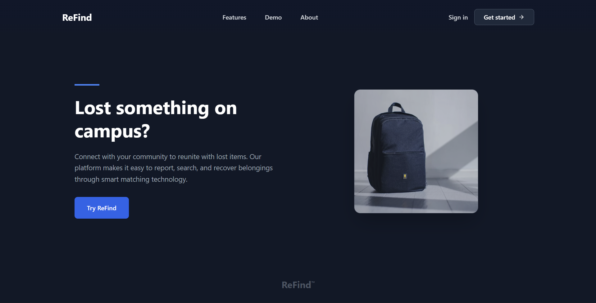
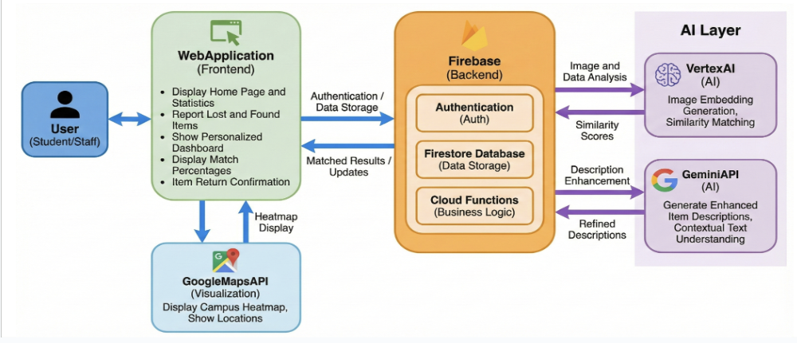
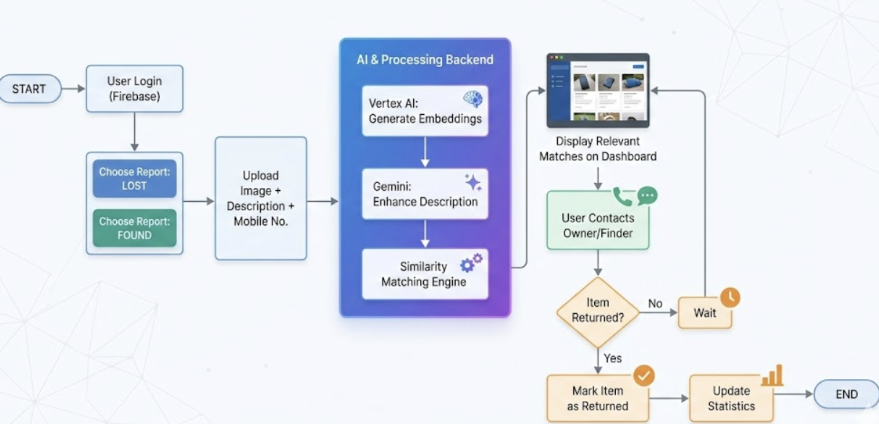
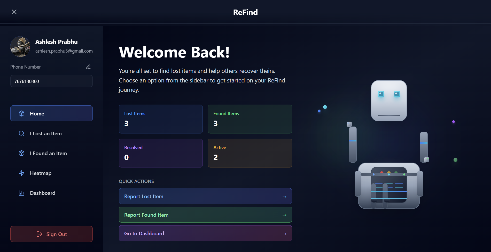
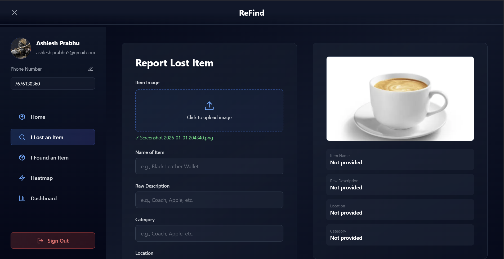
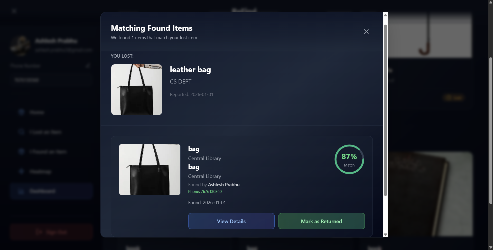
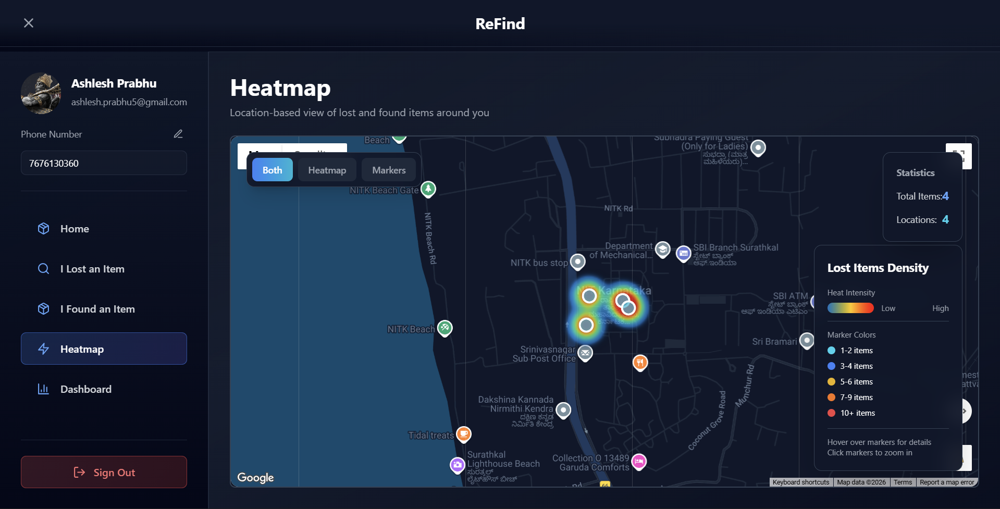

<div align="center">



</div>

# ReFind - AI-Powered Lost & Found Platform

**An intelligent lost and found system for campuses and closed communities that uses multimodal AI to automatically match lost and found items through image understanding, semantic embeddings, and vector similarity search.**

[](https://youtu.be/Zx_Yteviihg)

---

## Table of Contents

- [Overview](#overview)
  - [Problem Statement](#problem-statement)
  - [Solution](#solution)
- [Key Features](#key-features)
- [Architecture](#architecture)
  - [System Architecture](#system-architecture)
  - [Process Flow](#process-flow)
  - [Tech Stack](#tech-stack)
  - [System Design](#system-design)
  - [AI Pipeline](#ai-pipeline)
- [How It Works](#how-it-works)
- [Project Structure](#project-structure)
- [Setup Instructions](#setup-instructions)
  - [Prerequisites](#prerequisites)
  - [Installation](#installation)
  - [Environment Configuration](#environment-configuration)
  - [Local Development](#local-development)
  - [Deployment](#deployment)
- [API Documentation](#api-documentation)
- [Screenshots](#screenshots)
- [Security & Privacy](#security--privacy)
- [Limitations & Future Work](#limitations--future-work)
- [Team](#team)

---

## Overview

### Problem Statement

Traditional lost and found systems suffer from critical inefficiencies:

- **Manual browsing** through hundreds of unrelated items
- **Poor descriptions** that fail to capture item details
- **No intelligent matching** between lost and found items
- **Location blindness** with no spatial awareness
- **Time delays** in connecting owners with their belongings

These problems lead to:

- Low recovery rates (typically under 30%)
- Frustrated users who give up searching
- Cluttered lost & found offices
- Wasted time for both users and administrators

### Solution

ReFind leverages cutting-edge AI and vector search technology to solve these problems:

**Multimodal Understanding**: Gemini Vision API analyzes images to extract detailed item characteristics (color, material, brand, distinctive features) that users often forget to mention.

**Semantic Matching**: Text embeddings convert descriptions into 768-dimensional vectors, enabling similarity search that understands meaning rather than just keywords.

**Automatic Bidirectional Matching**: When a lost item is reported, the system automatically searches found items. When a found item is reported, it searches lost items. Both directions happen simultaneously.

**Location Intelligence**: Interactive heatmap visualization shows where items are most commonly lost, helping users prioritize search areas.

**Confidence Scoring**: Machine learning-based similarity scores help users quickly identify the most promising matches.

---

## Key Features

### Authentication & User Management

- Firebase Authentication with email and Google sign-in
- Secure session handling with automatic token refresh
- User profiles with phone verification for contact
- Profile editing with real-time updates

### Item Reporting

- **Lost Item Submission**: Upload photo, description, category, and location
- **Found Item Submission**: Report found items with same detailed information
- **Image Upload**: Cloudinary integration for optimized image storage
- **Location Selection**: Predefined campus locations with coordinate mapping
- **Category System**: Organized item categorization for better filtering

### AI-Powered Matching System

- **Image Analysis**: Gemini 2.0 Vision API extracts visual features from uploaded photos
- **Semantic Description**: AI generates detailed semantic summaries from images and text
- **Embedding Generation**: text-embedding-004 creates 768-dimensional vectors
- **Vector Similarity Search**: Vertex AI Vector Search finds similar items using dot product similarity
- **Bidirectional Matching**: Automatic matching in both directions (lost→found and found→lost)
- **Confidence Scoring**: Percentage match scores help prioritize likely matches

### Match Management

- **View Matches**: Browse AI-suggested matches with confidence scores
- **Match Details**: See detailed information including owner contact details
- **Confirm Return**: Mark items as returned with automatic status sync
- **Match History**: Track all previous matches and their outcomes
- **Manual Recheck**: Trigger on-demand re-evaluation for better matches

### Heatmap Visualization

- **Google Maps Integration**: Interactive map showing lost item density
- **Multiple View Modes**: Toggle between heatmap, markers, or combined view
- **Location Clusters**: Aggregated data showing item counts per location
- **Interactive Markers**: Click for details, hover for quick info
- **Real-time Statistics**: Live display of total items and active locations
- **Visual Density Indicators**: Color-coded markers based on item frequency

### Dashboard

- **Items You Lost**: View all your reported lost items with match counts
- **Items You Found**: Track found items you've reported
- **Status Tracking**: Real-time status updates (active, matched, resolved)
- **Quick Actions**: Fast access to report new items or view matches
- **Statistics Overview**: At-a-glance metrics on your activity

---

## Architecture

### System Architecture

<div align="center">



</div>

### Process Flow

<div align="center">



</div>

### Tech Stack

#### Frontend

``` md
React 18 + TypeScript
├── Vite - Build tool and dev server
├── Tailwind CSS - Utility-first styling
├── React Router - Client-side routing
├── Sonner - Toast notifications
├── Lucide React - Icon library
└── Google Maps JavaScript API - Map visualization
```

#### Backend

``` md
Firebase Platform
├── Cloud Functions (2nd Gen) - Serverless compute
├── Firestore - NoSQL database
├── Authentication - User management
└── Storage Rules - Access control
```

#### AI

``` md
Google Cloud Vertex AI
├── Gemini 2.0 - Vision and text understanding
├── text-embedding-004 - Semantic embeddings
└── Vector Search - Similarity matching (Tree-AH algorithm)
```

#### Infrastructure

```md
Google Cloud Platform
├── Cloud Functions - Event-driven compute
├── Firestore - Managed NoSQL database
├── Cloud Storage - Image storage via Cloudinary
└── IAM - Identity and access management
```

### System Design

The ReFind platform employs a sophisticated microservices architecture leveraging Google Cloud Platform services:

- **Frontend**: React-based SPA with TypeScript and Tailwind CSS
- **Backend**: Firebase Cloud Functions for serverless compute
- **Database**: Firestore for real-time data synchronization
- **AI Processing**: Vertex AI with Gemini Vision and embedding models
- **Vector Search**: Tree-AH algorithm for efficient similarity matching
- **Storage**: Cloudinary for optimized image delivery

### AI Pipeline

#### Step 1: Image Analysis

```typescript
// Gemini Vision extracts visual features
const imageAnalysis = await gemini.analyze(imageUrl);
// Output: "Blue leather wallet, Coach brand logo visible, 
//          worn corners, contains credit card slots"
```

#### Step 2: Semantic Description Generation

```typescript
// Combine user description + AI analysis
const semanticDescription = `
  Item: ${userInput.name}
  Visual: ${imageAnalysis}
  Details: ${userInput.description}
  Location: ${userInput.location}
`;
// Creates rich, searchable description
```

#### Step 3: Embedding Generation

```typescript
// Convert to 768-dimensional vector
const embedding = await textEmbedding004.embed(semanticDescription);
// Result: [0.023, -0.145, 0.892, ..., 0.234] (768 dimensions)
```

#### Step 4: Vector Upsert

```typescript
// Store in Vertex AI Vector Search index
await vectorSearch.upsert({
  id: itemId,
  embedding: embedding,
  metadata: { type: 'lost', userId, timestamp }
});
```

#### Step 5: Similarity Search

```typescript
// Find similar items using dot product
const matches = await vectorSearch.query({
  embedding: newItemEmbedding,
  topK: 10,
  filter: `type = 'found'`
});
// Returns items sorted by similarity score
```

#### Step 6: Bidirectional Matching

```typescript
// Store matches on both items
await Promise.all([
  updateLostItem(lostId, { matches: foundMatches }),
  updateFoundItem(foundId, { matches: lostMatches })
]);
```

---

## How It Works

### For Users Reporting Lost Items

1. **Report Lost Item**
   - Upload a photo of the item (or similar item)
   - Provide a text description
   - Select category and location
   - Submit the report

2. **AI Processing**
   - System analyzes the image using Gemini Vision
   - Generates semantic description combining text and visual features
   - Creates embedding vector and searches found items
   - Returns ranked list of potential matches

3. **Review Matches**
   - Browse AI-suggested matches with confidence scores
   - View detailed information and contact details
   - Mark item as returned when found

### For Users Reporting Found Items

1. **Report Found Item**
   - Upload photo of the found item
   - Describe what you found
   - Specify where you found it
   - Submit the report

2. **Automatic Matching**
   - System searches all reported lost items
   - Returns potential owners ranked by similarity
   - Stores matches for both parties to review

3. **Connect with Owner**
   - View contact information of potential owners
   - Coordinate return of the item
   - Mark as returned when complete

### For Administrators

1. **Monitor Activity**
   - View heatmap of lost item locations
   - Identify problematic areas
   - Track resolution rates

2. **System Management**
   - Monitor match quality
   - Trigger manual rechecks if needed
   - Manage user reports and disputes

---

## Project Structure

```md
refind/
├── functions/                      # Firebase Cloud Functions
│   ├── src/
│   │   ├── index.ts               # Main function entry point
│   │   ├── vertex.ts              # Vector search operations
│   │   ├── vertexEmbeddings.ts   # Embedding generation
│   │   ├── imageAI.ts            # Gemini Vision integration
│   │   ├── matcher.ts            # Matching logic
│   │   └── manualRecheck.ts      # Manual re-evaluation
│   ├── package.json
│   └── tsconfig.json
│
├── src/                           # React Frontend
│   ├── components/
│   │   ├── Dashboard.tsx          # Main dashboard
│   │   ├── HeatMap.tsx           # Map visualization
│   │   ├── Auth/
│   │   │   ├── Login.tsx
│   │   │   └── Register.tsx
│   │   └── Modals/
│   │       └── MatchedItems.tsx
│   │
│   ├── context/
│   │   └── AuthContext.tsx       # Authentication state
│   │
│   ├── lib/
│   │   ├── firebase.ts           # Firebase config
│   │   ├── cloudinary.ts         # Image upload
│   │   └── locations.ts          # Location data
│   │
│   ├── App.tsx                   # Root component
│   ├── main.tsx                  # Entry point
│   └── index.css                 # Global styles
│
├── public/                        # Static assets
├── .env.example                  # Environment variables template
├── firebase.json                 # Firebase configuration
├── firestore.rules              # Security rules
├── package.json
├── tsconfig.json
├── vite.config.ts
└── README.md
```

---

## Setup Instructions

### Prerequisites

- Node.js 18 or higher
- npm or yarn package manager
- Firebase CLI (`npm install -g firebase-tools`)
- Google Cloud project with billing enabled
- Firebase project created

### Installation

1.Clone the repository

```bash
git clone https://github.com/AshleshPrabhu/ReFind.git
cd ReFind
```

2.Install dependencies

```bash
# Install frontend dependencies
npm install

# Install function dependencies
cd functions
npm install
cd ..
```

3.Firebase Setup

```bash
# Login to Firebase
firebase login

# Initialize Firebase in your project
firebase init

# Select the following features:
# - Firestore
# - Functions
# - Authentication
```

### Environment Configuration

1. Create `.env` file in root directory

```env
# Firebase Configuration
VITE_FIREBASE_API_KEY=your_firebase_api_key
VITE_FIREBASE_AUTH_DOMAIN=your_project.firebaseapp.com
VITE_FIREBASE_PROJECT_ID=your_project_id
VITE_FIREBASE_STORAGE_BUCKET=your_project.appspot.com
VITE_FIREBASE_MESSAGING_SENDER_ID=your_sender_id
VITE_FIREBASE_APP_ID=your_app_id

# Cloudinary Configuration
VITE_CLOUDINARY_CLOUD_NAME=your_cloud_name
VITE_CLOUDINARY_UPLOAD_PRESET=your_upload_preset

# Google Maps API
VITE_GOOGLE_MAPS_API_KEY=your_maps_api_key
```

2.Set up Firebase Secrets for Cloud Functions

```bash
# Set Gemini API key
firebase functions:secrets:set GEMINI_API_KEY

# When prompted, enter your Gemini API key
```

3.Configure Vertex AI

- Enable Vertex AI API in Google Cloud Console
- Create a Vector Search index
- Deploy the index to an endpoint
- Update function code with your index/endpoint IDs

4.Configure IAM Permissions

```bash
# Grant Cloud Functions access to Vertex AI
gcloud projects add-iam-policy-binding YOUR_PROJECT_ID \
  --member="serviceAccount:YOUR_PROJECT_ID@appspot.gserviceaccount.com" \
  --role="roles/aiplatform.user"
```

### Local Development

1.Start the development server

```bash
npm run dev
```

The app will be available at `http://localhost:5173`

### Deployment

1.Build the frontend

```bash
npm run build
```

2.Deploy Cloud Functions

```bash
firebase deploy --only functions
```

---

## API Documentation

### Cloud Functions

#### `onLostItemCreate`

**Trigger**: Firestore document creation in `lost_items` collection

**Process**:

1. Analyzes uploaded image using Gemini Vision
2. Generates semantic description
3. Creates embedding vector
4. Upserts to Vector Search index
5. Searches for matching found items
6. Stores matches in both documents

**Input**: Firestore document with fields:

- `image`: string (URL)
- `name`: string
- `rawDescription`: string
- `category`: string
- `location`: string
- `userId`: string

**Output**: Updates document with:

- `semanticDescription`: string
- `embeddingId`: string
- `matches`: array of match objects

#### `onFoundItemCreate`

**Trigger**: Firestore document creation in `found_items` collection

**Process**: Same as `onLostItemCreate` but searches lost items instead

#### `manualRecheck`

**Trigger**: HTTP callable function

**Purpose**: Manually re-evaluate matches for an item

**Input**:

```typescript
{
  itemId: string,
  itemType: 'lost' | 'found'
}
```

**Output**: Returns updated match array

### Firestore Collections

#### `users`

```typescript
{
  uid: string,
  email: string,
  displayName: string,
  photoURL: string,
  phoneNumber: string,
  createdAt: Timestamp
}
```

#### `lost_items`

```typescript
{
  userId: string,
  name: string,
  rawDescription: string,
  semanticDescription: string,
  category: string,
  image: string,
  location: string,
  status: 'active' | 'resolved',
  embeddingId: string,
  matches: Array<{
    itemId: string,
    userId: string,
    score: number,
    status: 'pending' | 'confirmed' | 'rejected'
  }>,
  createdAt: Timestamp
}
```

#### `found_items`

```typescript
{
  userId: string,
  name: string,
  rawDescription: string,
  semanticDescription: string,
  category: string,
  image: string,
  location: string,
  status: 'active' | 'returned' | 'resolved',
  embeddingId: string,
  matches: Array<{
    itemId: string,
    userId: string,
    score: number,
    status: 'pending' | 'confirmed' | 'rejected'
  }>,
  createdAt: Timestamp
}
```

---

## Screenshots

### Dashboard View


*Main dashboard with user's reported items and match statistics*

### Report Lost Item


*Intuitive form with image upload and location selection*

### AI Matches


*Smart matching with percentage confidence and contact details*

### Heatmap


*Real-time visualization of lost item locations with multiple view modes*

---

### Future Optimizations

- Implement caching layer for frequent queries
- Add pagination for large match lists
- Use Cloud Tasks for async processing
- Implement rate limiting for API calls
- Add database connection pooling

---

## Security & Privacy

### Authentication

- Firebase Authentication with secure token management
- Session management with automatic token refresh
- Role-based access control (planned)

### Data Protection

- All user data encrypted at rest in Firestore
- Secure HTTPS connections for all requests
- Phone numbers only visible to matched users
- Images stored with secure Cloudinary URLs

### Access Control

- Firestore security rules restrict access to own items
- Match information only visible to relevant parties
- Cloud Functions use service account authentication
- IAM policies restrict GCP resource access
 handling (in progress)

---

## Limitations & Future Work

### Current Limitations

Technical

- Campus locations are demo-scoped to a single institution
- Heatmap uses basic circle markers instead of advanced density visualization
- No real-time notifications for new matches
- Manual recheck requires user action
- Limited to image + text inputs (no video support)

Features

- No direct chat between users
- No push notifications for matches
- Limited analytics dashboard
- No admin moderation tools
- Single-language support (English only)

Scale

- Tested primarily in campus environments
- Limited to one institution per deployment
- No multi-tenant support yet

### Future Improvements

1: Enhanced Matching

- Video analysis support for better identification
- Audio description processing for accessibility
- Multi-image uploads per item
- Time-based matching (prioritize recent items)
- Category-specific matching algorithms

2: User Experience

- In-app messaging between users
- Push notifications for matches and updates
- Email notifications with match summaries
- Progressive Web App (PWA) support
- Multi-language interface

3: Analytics & Insights

- Admin analytics dashboard
- Recovery rate tracking
- Location hotspot analysis
- User behavior insights
- Match quality metrics

---

## Team

<table>
  <tr>
    <td align="center">
      
      <br />
      <sub><b>Ashlesh Prabhu</b></sub>
      <br />
      <a href="https://www.linkedin.com/in/ashlesh-prabhu-bb457b312/">💼 LinkedIn</a>
    </td>
    <td align="center">
      
      <br />
      <sub><b>Vidith</b></sub>
      <br />
      <a href="https://www.linkedin.com/in/vidith-venkatesha-murthy?utm_source=share&utm_campaign=share_via&utm_content=profile&utm_medium=android_app">💼 LinkedIn</a>
    </td>
  </tr>
</table>

### Acknowledgments

- **Google Cloud** for Vertex AI and Gemini API access
- **Firebase** for backend infrastructure
- **Cloudinary** for image storage and optimization
- **Open Source Community** for invaluable tools and libraries

---

## Contact & Support

For questions, suggestions, or support:

- **Email**: <ashlesh.prabhu5@gmail.com>
- **GitHub Issues**: [Create an issue](https://github.com/AshleshPrabhu/ReFind/issues)

---

<div align="center">

#### Built with modern AI technology to reunite people with their lost belongings

[⭐ Star this repository](https://github.com/AshleshPrabhu/ReFind) if you find it useful!

**ReFind** - Intelligent matching for real-world recovery

</div>
